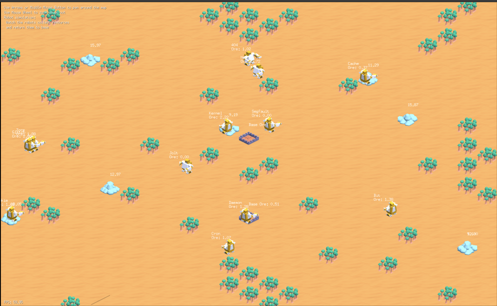

# ecs_sim

A large-scale unit simulation built in Go and the Ebiten, using an Entity Component System (ECS) architecture.

## [Watch the simulation! (link)](https://gfeyer.github.io/ecs_sim/)

In the simulation, robots search for minerals around the map, load them, and bring them back to base.

## Features

- **Rendering Engine**
  - Isometric tilemap rendering from TMX files.
  - Camera system supporting pan, zoom, and viewport culling for efficient rendering.

- **Entity Component System (ECS)**
  - A robust ECS core manages game entities, components, and systems.
  - Decoupled systems for logic like pathfinding, movement, rendering, and AI.

- **Pathfinding and Movement**
  - A* pathfinding for units on the tile-based world.
  - Smooth movement along calculated paths.

- **AI and Game Logic**
  - Robot AI system for autonomous unit behavior.
  - Event queue for managing game state changes and spawning units.
  - Factory system for creating and initializing game entities.

- **Input and Debugging**
  - Mouse and keyboard handling for camera control and unit interaction.
  - Comprehensive debug system to visualize paths, grids, and other internal states.

- **Asset Management**
  - Loads and manages game assets, including sprites from TMX tilesets.